# BucketList

## Overview

The Bucket List is a web application where users can create "Buckets" which are goal activities or places to travel with helpful dashboards to track those goals.

### Problem Space

This app will help people visualize their aspirations and track with real metrics their progress towards accomplishing those dream activities.

### User Profile

Anyone who has a bucket list, a dream vacation, or activity they're working towards and want a centralized location to track progress.

### Features

- A customizable bucket page where users can add a banner image and title for the bucket
- A chat board or note board in the case of single person activities
- An expense sheet for tracking costs related to the bucket
- A savings sheet for tracking contributions towards the bucket
- A progress marker that shows percentage of savings towards expenses
- Six pre-built themes

## Implementation

### Tech Stack

- HTML
- CSS
- Sass
- Javascript
- Axios
- React
- Express
- Toastify
- React Router Dom
- React Circular Progress Bar
- MySQL
- Knex

### APIs

- UnSplash for adding banner images
-

### Sitemap

- Home
- Sign Up / Log In
- Buckets List
- Bucket Add
- Bucket Details
- Bucket Chat
- Bucket Expenses
- Bucket Contributions
- Bucket Edit

### Mockups

See attached folder of example mock ups

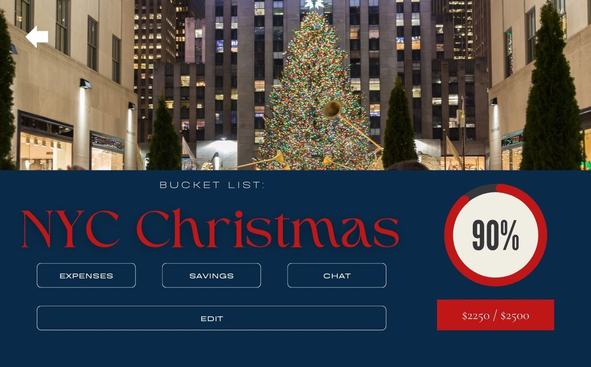
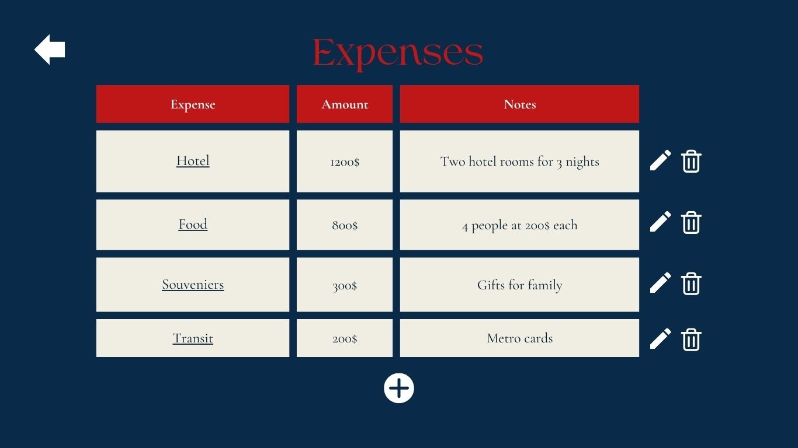
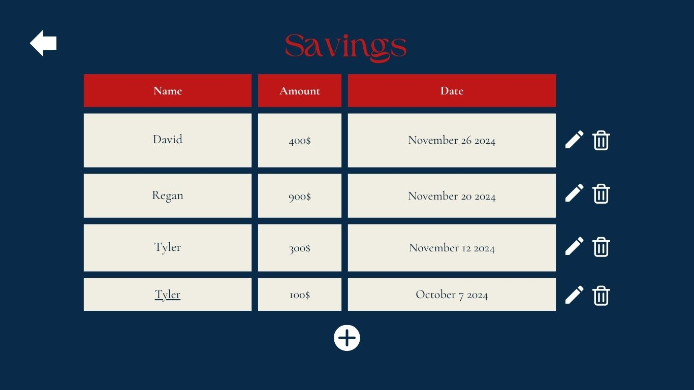
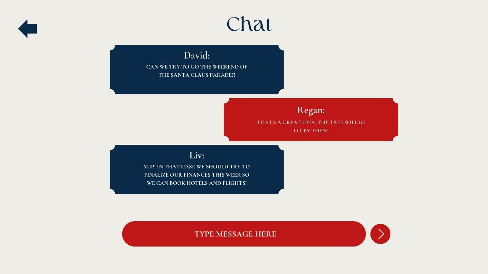
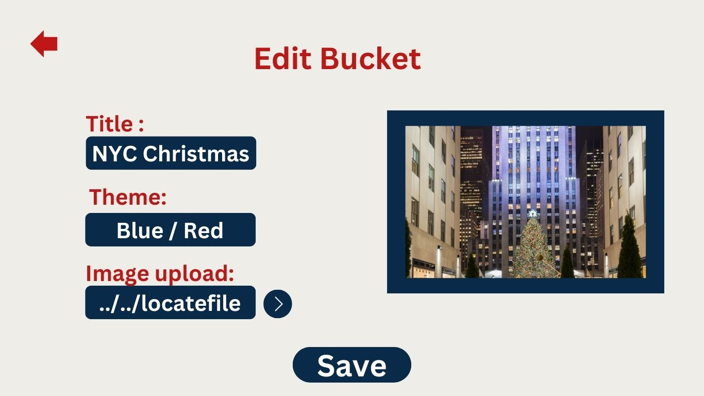

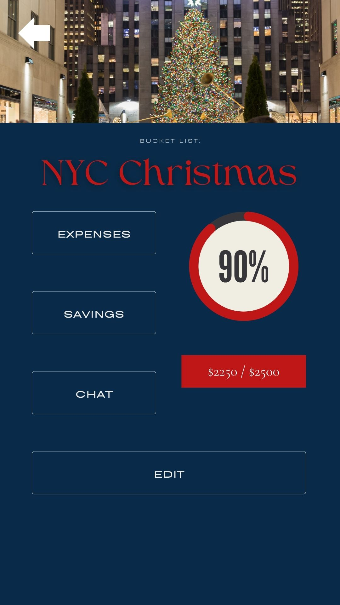
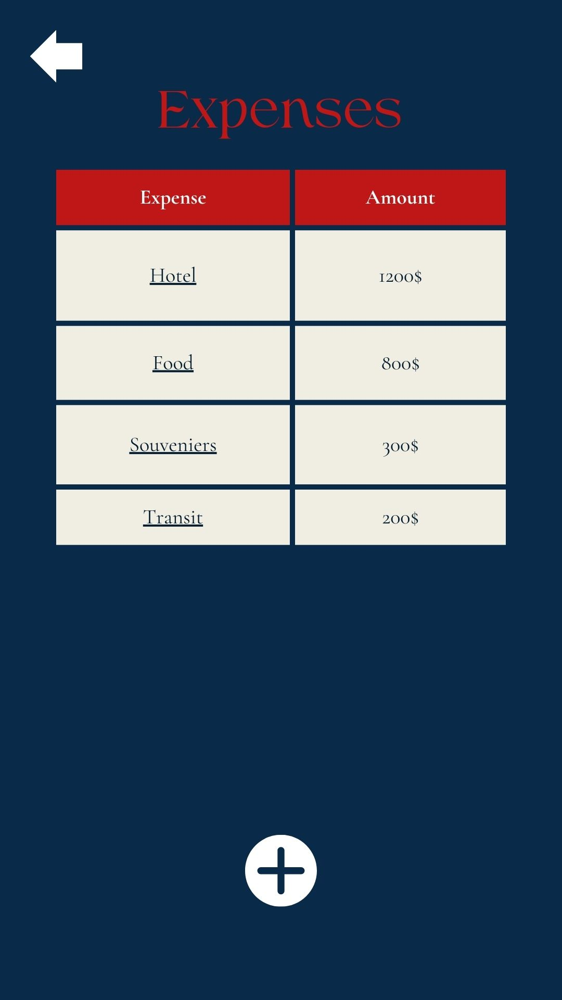
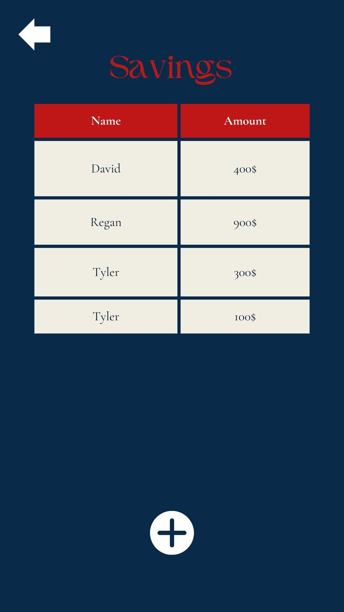
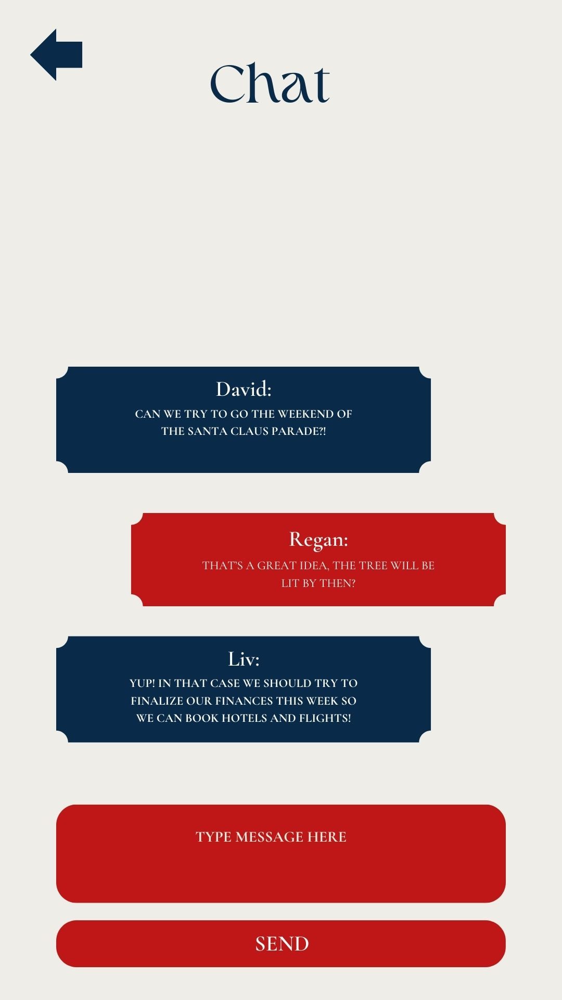
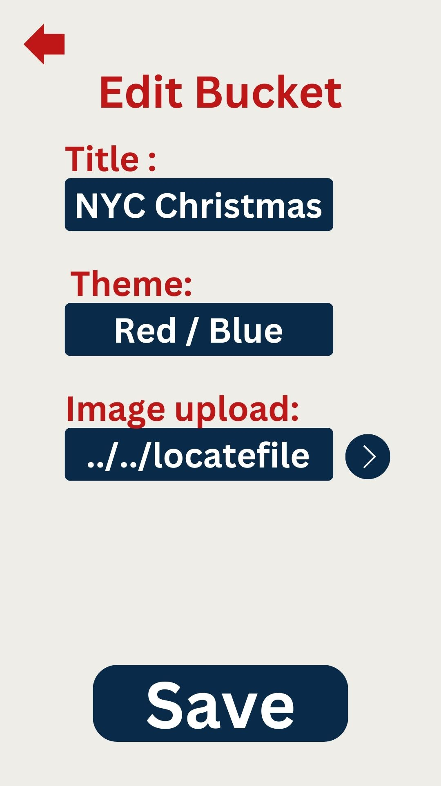

### Data

- Users sheet with ID, Name, and will have an associated list of buckets
- Buckets will have details like image, title, theme, FK to ID of Expense and Savings, and comments
- Expense sheet will have a FK to a bucket and have expense names, amounts, and notes
- Savings sheet will have a FK to a bucket and have contributiond details

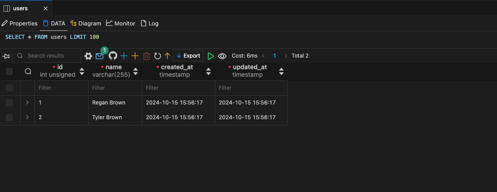
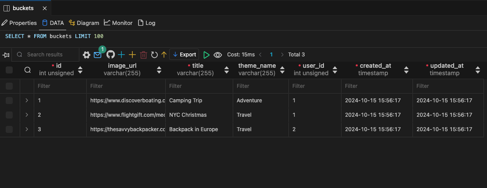
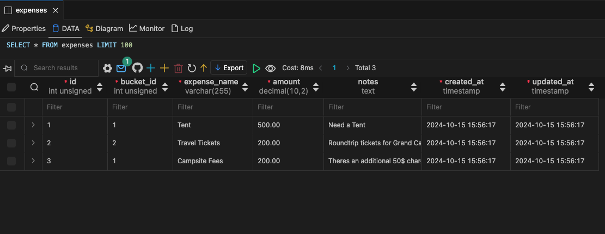
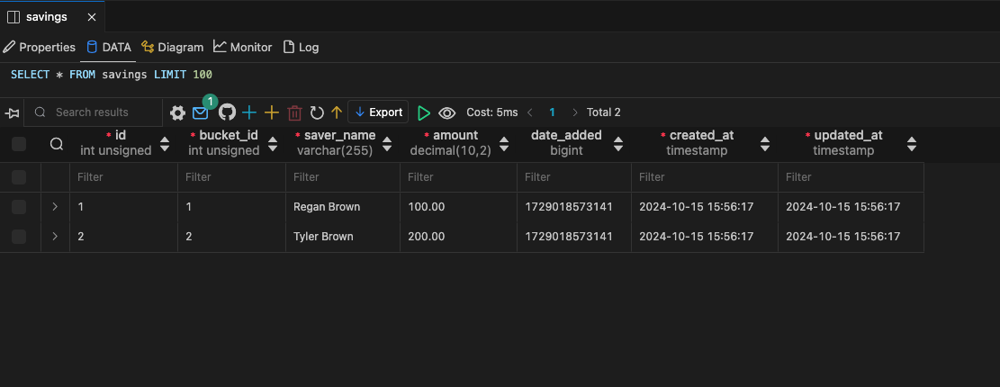
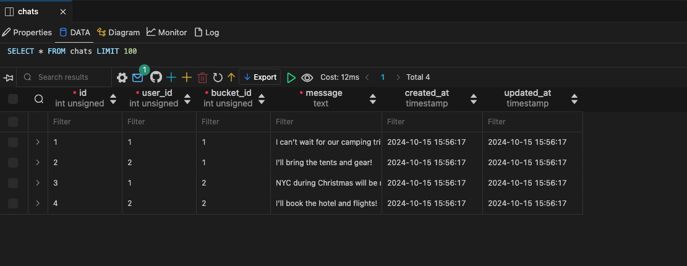

### Endpoints

##### Bucket

- GET - http://localhost${PORT}/buckets/ Provides a list of all buckets of authenticated user

- GET - http://localhost${PORT}/buckets/:BucketID Provides the details of one bucket

- POST - http://localhost${PORT}/buckets/ Add a new buckeet to the users list

- PUT - http://localhost${PORT}/buckets/:BucketID Updates one bucket details by given ID

- DELETE - http://localhost${PORT}/buckets/:BucketID Removes one bucket by given ID

##### Expense

- GET - http://localhost${PORT}/expenses/:BucketID Returns the expense list for a bucket

- POST - http://localhost${PORT}/expenses/:BucketID Creates an expense list for the bucket

- DELETE - http://localhost${PORT}/expenses/:BucketID/expenses/:ExpensesID Deletes an expense list associated to a bucket

##### Savings

- GET - http://localhost${PORT}/savings/:BucketID Returns the savings list for a bucket

- POST - http://localhost${PORT}/savings/:BucketID Creates an savings list for the bucket

- DELETE - http://localhost${PORT}/savings/:BucketID/savings/:SavingsID Deletes a savings list associated to a bucket

##### Chat

- GET - http://localhost${PORT}/chat/:BucketID Returns the savings list for a bucket

- POST - http://localhost${PORT}/chat/:BucketID Creates an savings list for the bucket

- DELETE - http://localhost${PORT}/chat/:BucketID/chats/:ChatID Deletes a savings list associated to a bucket

## Roadmap

See attached Roadmap

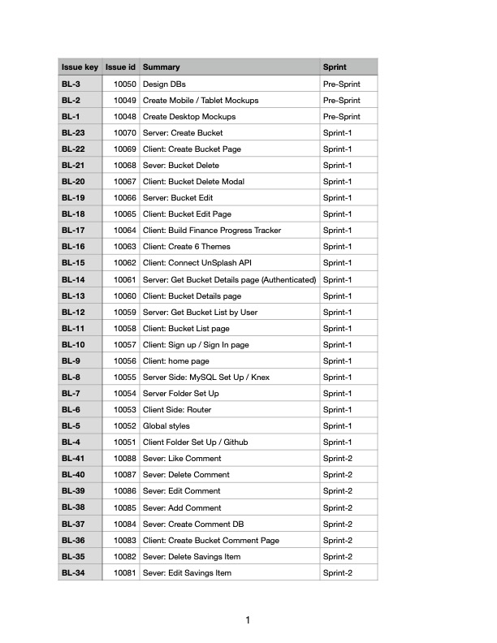

---

## Future Implementations

- User Authentication
- Multi user buckets
- Real time chat instead of comment board
- Bucket dashboard image as upload instead of stock images
- Additional page options for buckets like a mood board, or a links list where users can save links for hotels, excursions, etc.
- Customizable themes instead of the pre-builds
